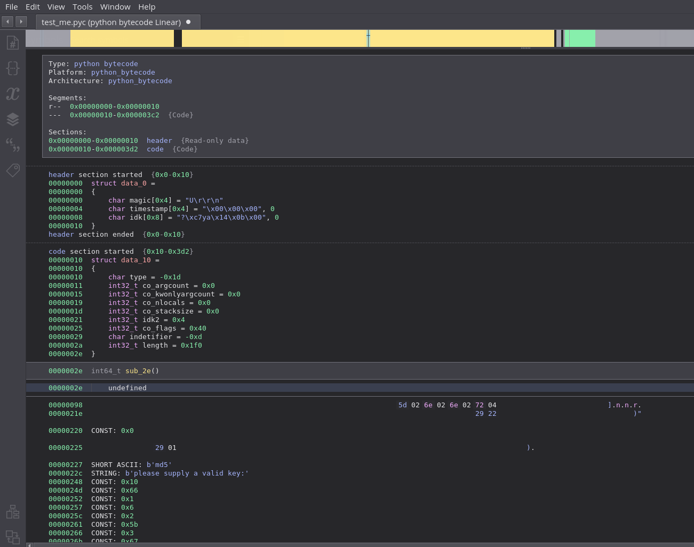
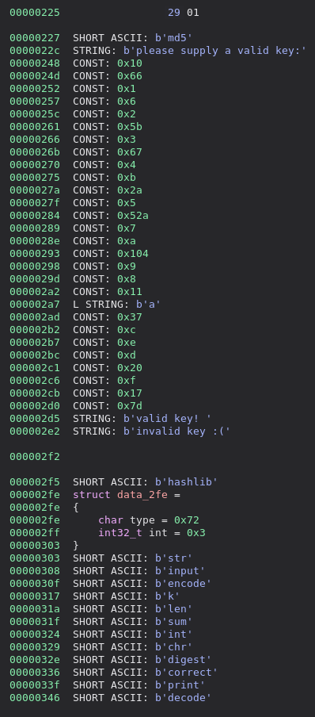
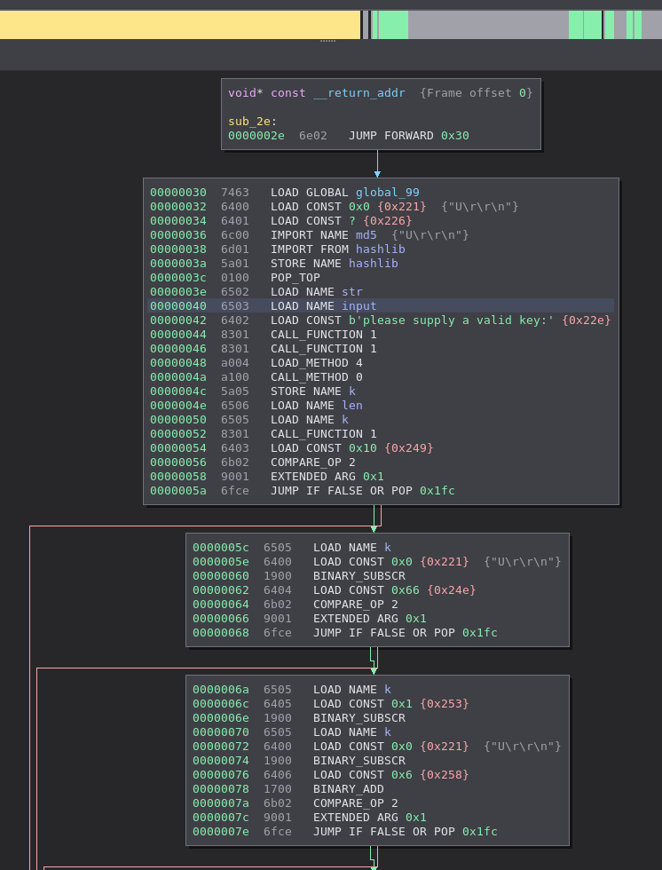
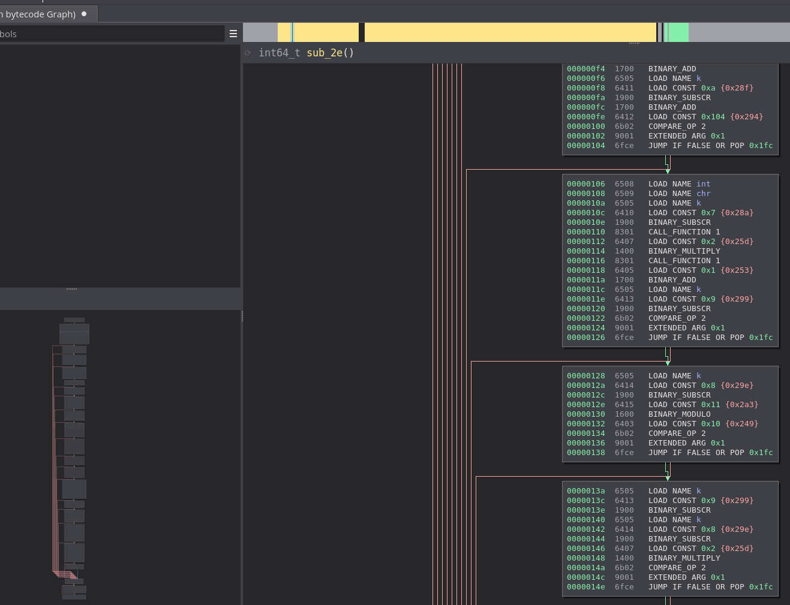
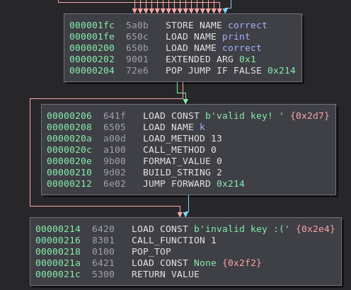

# WIP Python Bytecode Arch plugin and loader

## Loader
The loader allows for .pyc (curently 3.7+) files to be opened in binaryninja

This parses the header and each section in the binary, code gets disassembled, data gets typed as their proper structs

Using the DataRenderer, I converted some of the structs like constants and strings to a one line instruction token

Some types havent been converted yet

## Arch plugin

No lifting yet and need to implement more instructions.

Jumps are resolved and constants and strings are clickable to jump to where they are defined

## whats left
a lot
- rn only a few instructions are defined and parsed, so do the rest
- lifting
- make code way way less ugly